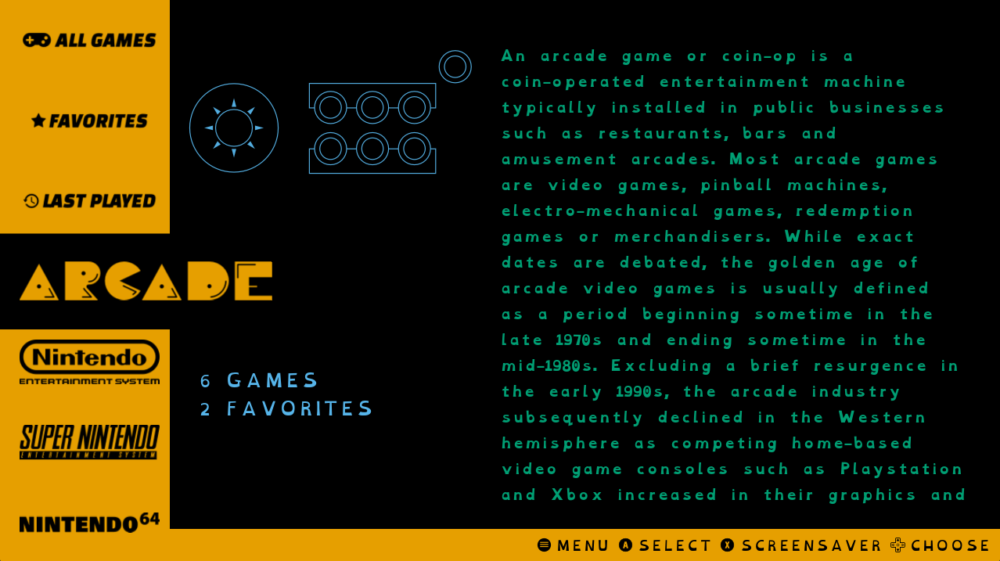

# ForAll theme for EmulationStation Desktop Edition

ForAll is a theme set for ES-DE that aims to make EmulationStation v2 more accessible to people with visual impairments, such as reduced vision or colorblindness and dyslexia. This is done by using larger text than is typical, the usage of fonts such as Atkinson Hyperlegible and Open-Dyslexic and implimentic color schemes based on standards set in IBM, Bang Wong and Paul Tol.

	

The following options are included: 

4 variants:

- Dyslexic with videos
- Dyslexic without videos
- Impaired with videos 
- Impaired without videos

8 color schemes: 

- Mono 
- Mono Variant
- IBM
- IBM Variant
- Bang Wong
- Bang Wong Variant
- Tol
- Tol Variant

4 aspect ratios:

- 4:3
- 16:9
- 16:10
- 21:9

